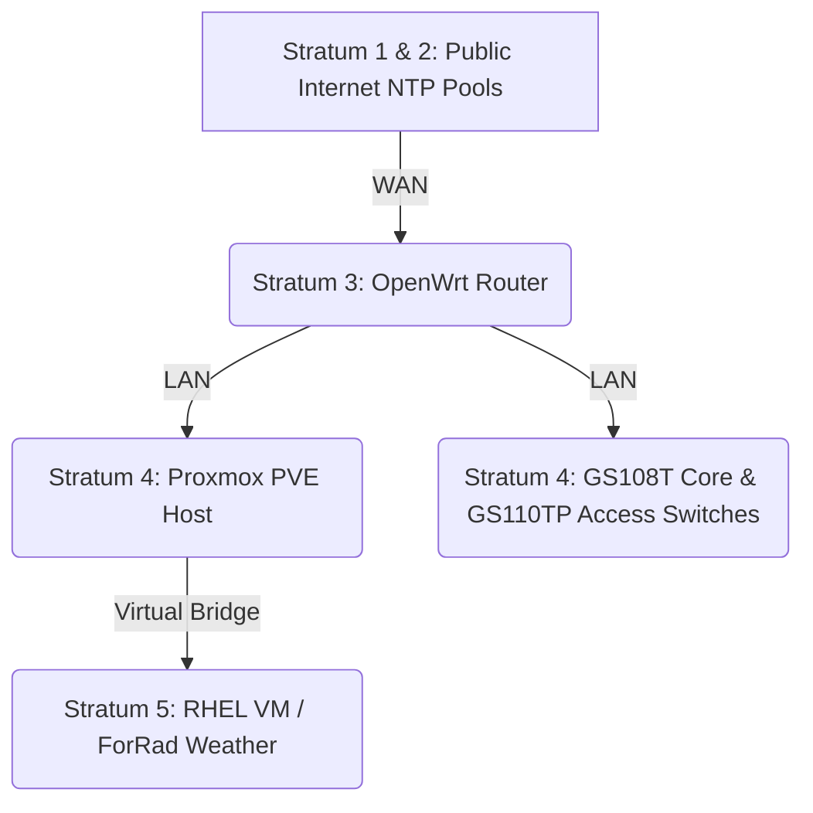

# Engineering Log: TIL: Fixing Proxmox Time Drift with a Local NTP Source

## Objective

    To synchronize the Proxmox hypervisor system clock with the local network gateway to prevent time drift, ensuring accurate log correlation and API timestamping across the host and its virtual machines.

---

## 1. The Baseline (The Control)

- **Expected State:** All infrastructure within the lab environment (hypervisors, core, and access switches) should synchronize system clocks with the local network gateway acting as the authoritative NTP server.

- **Current State:** Verified that the downstream network switches are successfully pulling time from the gateway. The time drift is isolated strictly to the Proxmox (PVE) hypervisor, ruling out a network-wide NTP broadcast issue.

## 2. The Symptoms

- **Error:** I noticed the system time on my Proxmox host was drifting by about a minute. While a minute seems minor, time synchronization across a network is critical. If the host clock is out of sync, correlating logs between the host and its VMs becomes incredibly difficult. For example, if the PVE host time drifts, troubleshooting the RHEL VM running the ForRad Weather dashboard would be a nightmare because the timestamp for a fetched API payload wouldn't match the host's network logs.

- **Observation:** Checking the status with timedatectl status confirmed the issue:

  System clock synchronized: no

- **Conclusion:** Because the core (GS108T) and access (GS110TP) switches are successfully maintaining time, the issue must reside in the local NTP daemon configuration of the Proxmox host itself, ruling out firewall drops or a network-wide NTP failure.

## 3. The Investigation

Proxmox uses chrony for NTP (Network Time Protocol) synchronization. I checked the active time sources using chronyc sources:

    Bash
    root@pve:~# chronyc sources
    MS Name/IP address         Stratum Poll Reach LastRx Last sample
    ===============================================================================

The output was completely blank. The NTP service was running, but Proxmox had no configured servers to pull time from.

## 4. The Root Cause

> [!IMPORTANT]
> **Conflict/Issue** > The Proxmox host's NTP daemon (`chrony`) was active, but completely lacked upstream server configurations. With no public pools or local gateway defined in its source files, the service had no authoritative time source to poll, leaving the hypervisor's local hardware clock to free-run and gradually drift.

## 5. The Resolution

- **Cleanup:** Instead of pointing the Proxmox host to a public internet pool (like pool.ntp.org), the best practice for a local network is to use the local gateway as the primary time source. The switches were already successfully pulling time from the OpenWrt router, so standardizing the PVE host to use the same internal source ensures the entire lab infrastructure stays in perfect sync.

I created a new .sources file in the chrony configuration directory, pointing it to the OpenWrt gateway IP:

    Bash
    echo 'server 192.168.1.1 iburst' > /etc/chrony/sources.d/openwrt.sources

(Note: The iburst option tells chrony to send a quick burst of packets to speed up the initial synchronization.)

Next, I reloaded the sources so the changes took effect without restarting the whole service:

    Bash
    chronyc reload sources

- **Verification:** To verify the host was successfully polling the router, I checked the sources again:

      Bash
      root@pve:~# chronyc sources -v
      MS Name/IP address         Stratum Poll Reach LastRx Last sample
      ===============================================================================
      ^* 192.168.1.1                   3   6    17    34    +89us[ +128us] +/-  132ms

  This output is a great real-world example of NTP Stratum hierarchy in action:



This output is a great real-world example of NTP Stratum hierarchy in action:

^^ (Current System Peer): The host successfully selected 192.168.1.1 as its authoritative time source.

Stratum 3: The OpenWrt router is acting as a Stratum 3 server (likely pulling from a Stratum 2 internet source), making the Proxmox host a Stratum 4 client.

Finally, checking timedatectl status confirmed the fix:

    System clock synchronized: yes

By keeping the time sync localized to the gateway, external NTP traffic is reduced, and it ensures that when the core routing is eventually cut over to a pfSense firewall, the internal NTP architecture is already standardized.

```

```
